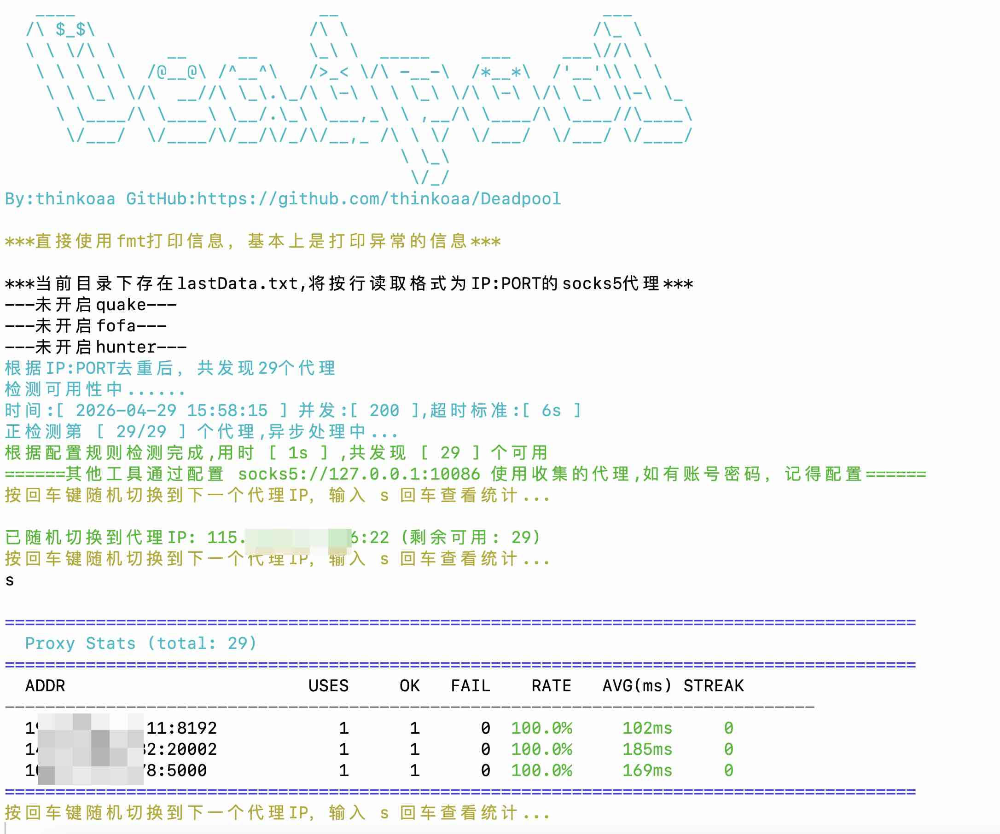

# DeadpoolPlus — 全球多协议代理池

DeadpoolPlus 是 [Deadpool](https://github.com/thinkoaa/Deadpool) 的增强版，支持从 **FOFA 空间测绘**、**公开代理池**、**免费代理列表** 等多种渠道自动化采集 **SOCKS5 / SOCKS4 / HTTP / HTTPS** 代理，经存活检测后汇聚成本地代理池，供 Burp Suite、Proxifier、SwitchyOmega 等工具轮询切换出口 IP。

> 🚀 **核心增强：**
> 1. **全协议支持** — SOCKS5 / SOCKS4 / HTTP / HTTPS，四协议全覆盖
> 2. **智能协议探测** — 未知协议的 IP:PORT 自动生成四种协议变体，由健康检测筛选有效协议
> 3. **代理池爬取** — 从 FOFA 搜索公开代理池服务，爬取已维护好的代理
> 4. **公开列表下载** — 从 GitHub/API 等公开代理列表批量下载

---

## 更新日志

**2026-06-10（DeadpoolPlus v1.1）**
1. 🆕 全协议支持：**SOCKS5 + SOCKS4 + HTTP + HTTPS**
2. 🆕 代理池爬取：FOFA 搜索 `body="get all proxy from proxy pool"` → 并发爬取 `/all` 接口
3. 🆕 公开列表下载：支持从 raw.githubusercontent.com 等 URL 批量下载代理列表
4. 🔧 智能协议探测：代理池返回的纯 IP:PORT 自动生成四种协议变体，健康检测筛选有效协议
5. 🔧 `GetProxiesFromPools` 改为并发爬取（50 并发），效率大幅提升
6. 🔧 新增 `GetProxiesFromURLs` 函数，支持无协议前缀的代理列表

**2026-06-07（DeadpoolPlus）**
1. 多协议支持：上游代理从仅 SOCKS5 扩展到 SOCKS5 + HTTP
2. 代理地址格式统一为 `protocol://IP:PORT`
3. 文件触发统计（`.dump_stats`），后台运行也可查看
4. 新增 `dialViaHTTPConnect`、`dialViaHTTPSConnect`、`dialViaSocks4` 拨号器

**2026-06-04（DeadpoolPlus）**
1. FOFA 支持多查询语句：`queryString` → `queryStrings` 数组，按国家分别查询，绕过单次 10000 条上限
2. 内置全球 184 个国家/地区查询列表（排除 CN/HK/MO），代理采集量从万级跃升至百万级

**2026-04-29（原版）**
1. 添加 GoReleaser 自动发版配置
2. 代理健康检查优化 + 统计信息展示 + 优雅关闭
3. 代理切换策略优化（随机轮询）+ 配置验证功能
4. 修复 4 个 Bug + 日志分级功能
5. 添加 ANSI 颜色输出 + 移除弃用的 rand.Seed + 支持强制退出

**2024-09-15：** 增加周期性任务，定时检测存活、定时从网络空间取代理

**2024-09-12：** Go 1.23，新增 SOCKS5 账号密码认证

---

## 免责声明

本工具仅面向**合法授权**的企业安全建设行为。使用者应确保行为符合当地法律法规并已取得足够授权。非法使用产生的后果由使用者自行承担。

---

## 目录

- [0x01 核心思路](#0x01-核心思路)
- [0x02 效果展示](#0x02-效果展示)
- [0x03 快速开始](#0x03-快速开始)
- [0x04 配置说明](#0x04-配置说明)
- [0x05 GitHub Action 自动化](#0x05-github-action-自动化)
- [0x06 编译多平台二进制](#0x06-编译多平台二进制)

---

## 0x01 核心思路

在攻防过程中 IP 被 ban 是家常便饭。DeadpoolPlus 解决的是一个经典问题：**如何白嫖海量高质量的 SOCKS5 代理，且不花钱。**

### 工作流程

```
┌──────────┐   ┌──────────┐   ┌──────────┐
│  FOFA    │   │  Hunter  │   │  Quake   │    ← 网络空间测绘平台
│ 184国查询│   │ (可选)    │   │ (可选)    │
└────┬─────┘   └────┬─────┘   └────┬─────┘
     │               │               │
     └───────────────┼───────────────┘
                     ▼
         ┌───────────────────────┐
         │  lastData.txt         │   ← 本地已有代理（可手动补充）
         └───────────┬───────────┘
                     ▼
         ┌───────────────────────┐
         │  去重 + 并发存活检测    │   ← 可配并发数/超时/关键字/地理围栏
         └───────────┬───────────┘
                     ▼
         ┌───────────────────────┐
         │  有效代理池            │   ← 写入 lastData.txt 持久化
         └───────────┬───────────┘
                     ▼
         ┌───────────────────────┐
         │  本地 SOCKS5 服务      │   ← 默认 127.0.0.1:10086
         │  随机轮询 + 统计 + 淘汰 │
         └───────────┬───────────┘
                     ▼
            外部工具接入使用
     （Burp / Proxifier / SwitchyOmega / ...）
```

### DeadpoolPlus vs 原版 Deadpool

| 特性 | 原版 Deadpool | DeadpoolPlus |
|---|---|---|
| 代理协议 | 仅 SOCKS5 | **SOCKS5 + SOCKS4 + HTTP + HTTPS** |
| 代理来源 | FOFA/Hunter/Quake | FOFA + **代理池爬取** + **公开列表下载** |
| 智能协议探测 | ❌ | ✅ 未知 IP:PORT → 四种协议变体 → 自动筛选 |
| FOFA 查询 | 单条 `queryString` | `queryStrings` 数组 + 代理池搜索 |
| 单次最大采集量 | 10,000 条 | 多渠道聚合可达 **数十万** 条 |
| 代理统计 | ✅ | ✅ |
| 随机轮询 | ✅ | ✅ |
| 连续失败淘汰 | ✅ | ✅ |
| 优雅关闭 | ✅ | ✅ |
| 文件触发统计 | ❌ | ✅ 创建 `.dump_stats` 即可查看 |

---

## 0x02 效果展示

启动后自动从各平台拉取代理并进行存活检测：



FOFA 多国轮询查询过程：


监听到请求后随机轮询代理转发：


验证代理出口 IP：


目录爆破场景（IP 被 ban 自动切下一个）：


---

## 0x03 快速开始

### 1. 配置 API Key

编辑 `config.toml`，填入网络空间测绘平台的 API Key：

```toml
[FOFA]
switch = 'open'                              # 启用
apiUrl = 'https://fofa.info/api/v1/search/all'
email = 'your@email.com'
key = 'your-fofa-api-key'
queryStrings = [...]                         # 已内置 184 个国家，开箱即用
resultSize = 10000                           # 每条查询最大返回数

[HUNTER]
switch = 'open'
# ... 填入 key

[QUAKE]
switch = 'open'
# ... 填入 key
```

> **至少开启一个平台**即可运行。推荐主要靠 FOFA（覆盖最广），Hunter 和 Quake 作为补充。

### 2. 运行

```bash
# 直接运行（使用默认 config.toml 和 lastData.txt）
./deadpoolplus

# 指定配置文件
./deadpoolplus -c custom_config.toml

# 只使用本地已有代理文件，不从平台拉取
./deadpoolplus -l my_proxies.txt

# 显示帮助
./deadpoolplus -h
```

### 3. 在工具中配置代理

将任意工具的 SOCKS5 代理指向：

```
socks5://127.0.0.1:10086
```

如果配置了用户名密码认证，填上即可。

#### Burp Suite


#### Proxifier


#### SwitchyOmega


### 4. 运行中操作

| 操作 | 功能 |
|---|---|
| 按 `Enter` | 随机切换到下一个代理 IP |
| 按 `s` + `Enter` | 查看代理统计（使用次数/成功率/响应时间/连败） |
| `Ctrl+C` 一次 | 优雅退出：打统计、等活跃连接完成（最多 30s） |
| `Ctrl+C` 两次 | 强制退出 |

---

## 0x04 配置说明

完整配置项参考 `config.toml`：

```toml
[listener]
IP = '127.0.0.1'          # 监听地址
PORT = 10086              # 监听端口
userName = ''             # 认证用户名（空=不认证）
password = ''             # 认证密码
logLevel = 'normal'       # normal: 仅重要信息 / debug: 打印每个请求的代理

[checkSocks]
checkURL = 'http://www.msftconnecttest.com/connecttest.txt'  # 检测URL（微软连通性测试，全球可达）
checkRspKeywords = 'Microsoft Connect Test'                   # 响应必须包含的关键字
maxConcurrentReq = 1000   # 并发检测数（VPS 500-1000）
timeout = 3               # 超时秒数
maxFailCount = 3          # 连续失败N次淘汰

[FOFA]                    # ★ 核心：FOFA 空间测绘
switch = 'open'
email = 'your@email.com'
key = 'your-fofa-key'
queryStrings = [...]      # SOCKS5查询语句数组（24个高产国家）
resultSize = 10000        # 每条查询最大返回数

# ★ 代理池爬取：搜索公开代理池 → 爬取已维护代理
poolQueryString = 'body="get all proxy from proxy pool"'
poolResultSize = 10000

# ★ 公开代理列表：从GitHub/API批量下载
proxyListUrls = [
    'https://raw.githubusercontent.com/TheSpeedX/PROXY-List/refs/heads/master/socks5.txt',
    'https://raw.githubusercontent.com/TheSpeedX/PROXY-List/refs/heads/master/http.txt',
    # ... 更多见 config.toml
]
```

### 进阶技巧

1. **筛选不拦截恶意 Payload 的代理：** 关闭地理围栏，将 `checkURL` 改为无 WAF 的公网地址，URL 中带测试 Payload，`checkRspKeywords` 设为目标正常返回的字符片段。

2. **针对特定目标筛选：** 将 `checkURL` 设为目标地址，`checkRspKeywords` 设为只有通过代理能访问目标时才会出现的字符串。

---

## 0x05 GitHub Action 自动化

利用 GitHub Action 定时运行 DeadpoolPlus，自动更新 `lastData.txt`。

### 1. Import 仓库

由于 fork 无法修改仓库可见性，需要 **Import** 为本仓库使其变成私有。


> ⚠️ **务必勾选 Private！** 否则 API Key 会随公开仓库泄漏。

### 2. 配置 Action 写入权限


### 3. 添加 Workflow

`.github/workflows/schedule.yml`：

```yaml
name: schedule

on:
  workflow_dispatch:
  schedule:
    - cron: "0 0 */5 * *"

jobs:
  build:
    runs-on: ubuntu-latest
    steps:
      - name: Check out code
        uses: actions/checkout@v3
        with:
          fetch-depth: 0

      - name: Set up Go
        uses: actions/setup-go@v4
        with:
          go-version: 1.23.x
          check-latest: true
          cache: true

      - name: Run search
        run: bash entrypoint.sh

      - name: Commit and push if changed
        run: |
          git config --global user.name 'your-name'
          git config --global user.email 'your-email'
          if git diff --quiet -- lastData.txt; then
            echo "lastData.txt has not been modified."
          else
            git add lastData.txt
            git commit -m "update lastData.txt"
            git push
          fi
```

### 4. 启动脚本

`entrypoint.sh`：

```sh
#!/bin/bash
go build -o deadpoolplus main.go
timeout --preserve-status 150 ./deadpoolplus
status=$?
if [ $status -eq 124 ]; then
    echo "The command timed out."
else
    echo "The command finished successfully."
fi
exit 0
```

> `timeout` 值根据数据量调整。FOFA 184 个国家查询耗时会比原版长很多，建议设足够大。

### 5. 完整目录结构


---

## 0x06 编译多平台二进制

```bash
# Linux x64
CGO_ENABLED=0 GOOS=linux GOARCH=amd64 go build -ldflags="-s -w" -o build/deadpoolplus_linux_amd64 main.go

# Linux ARM64
CGO_ENABLED=0 GOOS=linux GOARCH=arm64 go build -ldflags="-s -w" -o build/deadpoolplus_linux_arm64 main.go

# Windows x64
CGO_ENABLED=0 GOOS=windows GOARCH=amd64 go build -ldflags="-s -w" -o build/deadpoolplus_windows_amd64.exe main.go

# Windows ARM64
CGO_ENABLED=0 GOOS=windows GOARCH=arm64 go build -ldflags="-s -w" -o build/deadpoolplus_windows_arm64.exe main.go

# macOS Intel
CGO_ENABLED=0 GOOS=darwin GOARCH=amd64 go build -ldflags="-s -w" -o build/deadpoolplus_darwin_amd64 main.go

# macOS Apple Silicon
CGO_ENABLED=0 GOOS=darwin GOARCH=arm64 go build -ldflags="-s -w" -o build/deadpoolplus_darwin_arm64 main.go
```

或使用 GoReleaser：`goreleaser build --snapshot --clean`

---

## 致谢

- [Deadpool](https://github.com/thinkoaa/Deadpool) — 原作者 [thinkoaa](https://github.com/thinkoaa)，本工具在此基础上增强而来
- [go-socks5](https://github.com/armon/go-socks5) — SOCKS5 协议实现
- [go-toml](https://github.com/pelletier/go-toml) — TOML 解析
- [cron](https://github.com/robfig/cron) — Cron 调度

---

> **如果觉得有用，给原版和 DeadpoolPlus 都点个 Star ⭐**
